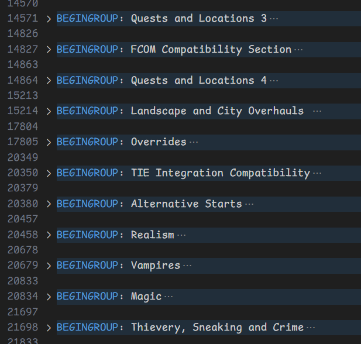

# vscode-boss-masterlist

Unofficial VSCode language support for BOSS's masterlist.txt.

BOSS—Better Oblivion Sorting Software—is a sorting utility for Oblivion plugins. Grab it [here](https://boss-developers.github.io).

## Features

Syntax highlighting and mild integration support.

